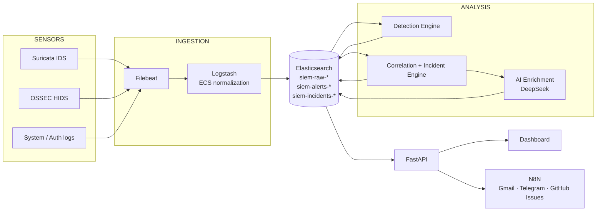

<div align="center">

# ▛▀▀ NOCTUA ▀▀▜

### AI-AUGMENTED SIEM PLATFORM · SOC 4.0

**OBSERVE. CORRELATE. EXPLAIN.**


</div>

---

## ▌01 · MISSION BRIEF

Modern SOC analysts drown in alerts: heterogeneous logs, isolated detections, no story.
**NOCTUA** turns a raw stream of security events into **correlated, prioritized and explained incidents**.

It covers the full chain, from collection to analyst-ready narrative:

| PHASE | CAPABILITY |
|---|---|
| **COLLECT** | Logs and sensor data ingested and normalized to ECS |
| **DETECT** | Multi-domain detection engine (network, host, authentication, DNS) |
| **CORRELATE** | Multi-layer correlation across sources, mapped to MITRE ATT&CK |
| **EXPLAIN** | LLM-based narrative enrichment of every incident |
| **RESPOND** | Severity-based routing to Gmail, Telegram and GitHub Issues |

Built as a final-year engineering project (PFE) in partnership with **NearSecure**.

---

## ▌02 · KEY FIGURES

| | |
|:---:|:---|
| **16** | correlation types mapped to MITRE ATT&CK |
| **29** | attack scenarios replayed to validate the pipeline |
| **8** | real-time notification event types |
| **3** | Elasticsearch indices: raw events, alerts, incidents |
| **8** | nodes in the N8N response workflow |

---

## ▌03 · ARCHITECTURE



### Rules of engagement

> **The Detection Engine and the API never share memory and never import each other.**
> They communicate exclusively through Elasticsearch.

**Why it matters:** each component restarts independently and stays stateless, Elasticsearch is the single source of truth, and a crash in one layer never corrupts another.

---

## ▌04 · DETECTION

A custom rule engine evaluates normalized events and builds validated alerts.

| MODULE | ROLE |
|---|---|
| `rule_engine.py` | Rule evaluation against incoming events |
| `accumulator.py` | Stateful counting and time windows (thresholds, spreads) |
| `alert_builder.py` | Alert construction and enrichment |
| `alert_validator.py` | Schema and consistency checks before writing |
| `alert_writer.py` | Persistence to `siem-alerts-*` |

**Sample detection use cases**

- SSH brute force
- Password spraying vs distributed brute force
- Suspicious DNS activity
- Network C2 beaconing
- IDS-signature-based alerts (Suricata)
- Watchlist-based severity escalation

---

## ▌05 · CORRELATION

Isolated alerts are noise. NOCTUA links them.

- **16 correlation types**, each mapped to a MITRE ATT&CK tactic / technique
- **Multi-layer correlation**: network, host and authentication events combined into a single incident
- **Cross-layer incidents** flagged explicitly (`is_cross_layer`) for fast triage
- **Kill chain tracking**: from reconnaissance to impact, in one timeline

---

## ▌06 · AI ENRICHMENT

Every incident receives a **written narrative** generated by an LLM (DeepSeek):

- what happened, in plain language
- which TTPs are involved
- why it matters, and what to check next

The goal is a first step toward an **agentic SOC**: enriched correlation, assisted prioritization, less alert fatigue. The analyst keeps the decision.

---

## ▌07 · LIVE NOTIFICATIONS

Server-Sent Events stream (`GET /api/notifications/stream`) polling Elasticsearch every 3 seconds.

| EVENT | TRIGGER |
|---|---|
| `incident_created` | New incident |
| `incident_updated` | Severity escalation |
| `incident_closed` | Incident closed |
| `incident_reopened` | Incident reopened |
| `cross_layer_correlation` | Multi-layer incident detected |
| `alert_created` | New alert |
| `alert_closed` | Alert closed |
| `alert_reopened` | Alert reopened |

Clicking a notification routes straight to the incident or alert page.

---

## ▌08 · AUTOMATED RESPONSE (LIGHTWEIGHT SOAR)

An **8-node N8N workflow** receives incident webhooks and routes them by severity:

```
INCIDENT ──► WEBHOOK ──► SEVERITY ROUTER ──┬──► GMAIL
                                           ├──► TELEGRAM
                                           └──► GITHUB ISSUES
```

---

## ▌09 · VALIDATION

A Python **multi-vector attack simulator** replays **29 scenarios** end to end:

- SSH brute force
- Password spray
- Distributed brute force
- Suspicious DNS
- IDS injection
- Watchlist escalation
- Cross-layer multi-vector incidents
- Full kill chain

```bash
sudo python3 scripts/attack_simulator.py
```

Test cases use isolated IP ranges so they never mix with real traffic.

---

## ▌10 · TECH STACK

| LAYER | TECHNOLOGY |
|---|---|
| **Detection sensors** | Suricata (IDS), OSSEC (HIDS) |
| **Ingestion** | Filebeat, Logstash, ECS normalization |
| **Storage / Search** | Elasticsearch |
| **Backend** | Python, FastAPI |
| **Frontend** | HTML, CSS, JavaScript (vanilla) |
| **AI** | DeepSeek (LLM) |
| **Automation** | N8N, Webhooks, REST API |
| **Frameworks** | MITRE ATT&CK, Cyber Kill Chain |
| **DevOps** | Docker, Docker Compose, Git |

---

## ▌11 · DEPLOYMENT

```bash
# 1. Clone
git clone https://github.com/abduu771-hub/noctua-siem.git
cd noctua-siem

# 2. Install dependencies
pip install -r requirements.txt

# 3. Configure (never commit secrets)
export ELASTIC_URL="http://localhost:9200"
export ELASTIC_USER="<your-user>"
export ELASTIC_PASSWORD="<your-password>"
export DEEPSEEK_API_KEY="<your-key>"

# 4. Start the API
uvicorn api.main:app --port 8000

# 5. Start the detection engine (separate process)
python3 -m <your_detection_entrypoint>
```

Then open the dashboard and run the simulator to see alerts and incidents appear.

---

## ▌12 · REPOSITORY LAYOUT

```
noctua-siem/
├── api/
│   ├── main.py
│   └── routes/
│       └── notifications.py
├── detection/
│   ├── rule_engine.py
│   ├── accumulator.py
│   ├── alert_builder.py
│   ├── alert_validator.py
│   └── alert_writer.py
├── frontend/
│   ├── pages/
│   └── shared/
├── scripts/
│   └── attack_simulator.py
├── config.py
└── README.md
```

---

## ▌13 · ROADMAP

- [x] Collection, normalization, multi-domain detection
- [x] Multi-layer correlation mapped to MITRE ATT&CK
- [x] LLM narrative enrichment
- [x] Real-time notifications and automated routing
- [x] End-to-end validation with 29 simulated scenarios

---

## ▌14 · OPERATOR

**Abderrahmane Boukoutti**
State Engineer in Computer Science · Defensive Cybersecurity · SOC & SIEM

[](https://www.linkedin.com/in/abderrahmane-boukoutti-6a1434272/)
[](https://github.com/abduu771-hub)
[](mailto:boukoutti.abderrahmane@outlook.com)

<div align="center">

`           NOCTUA 
· DETECT · CORRELATE · EXPLAIN`

</div>
